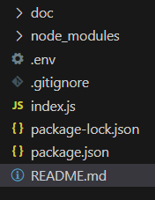

# Path2Tech Mongoose Tutorial

This repository will help guide you on getting familiar with using Mongoose in a Node.js environment

## Prerequisites
- Node.js and NPM installed
- An environment to run JavaScript
    - Having Node.js installed on your system
    - You can run JavaScript with Visual Studio code if you have the Node.js extension installed
- A MongoDB account set up with a cluster to connect to.


## Checking Prerequisites
1. Check that you have Node and NPM installed, open a terminal and run

```sh
node --version
```

```sh
npm --version
```

If you get an error then you will need to go to [Download Node](https://nodejs.org/en/download) to download Node.js for your operating system.

2. You wil need to have a MongoDB Atlas Account with a MongoDB Cluster set up. To accomplish this go to [MongoDB Atlas Account Creation](https://account.mongodb.com/account/register) to create an account and create a cluster. Once you create your cluster you should eventually see a connection string with your credentials to be able to connect, below is an example of what your credendtials should look like.


**You will need to replace <db_username> with the username of your CREATED user (not your actual MongoDB login credentials) and replace <db_password> with the password of your CREATED user (not your actual MongoDB login credentials)**


## Installing Project
1. Please make sure to fork this repository to your personal GitHub
2. Clone the repository to your machine

## Getting Started
1. You will have to install your node packages from `package.json` to `node_modules`

To accomplish this, open this project in Visual Studio Code, and open a new terminal session

Run the command
```sh
npm install
```

2. Get your MongoDB Connection string and create a new file called `.env` which needs to be located in the ROOT directory of this project. Below is an example of what your project directory structure should look like 



After you create your `.env` file open it up in your Visual Studio Code and add this to it:

```
DB_URL="Replace Database URL with the URL of your MongoDB Cluster"
```

3. To run the code you have two options, to run it with Visual Studio Code's GUI or to open a terminal and run the following command

```sh
npm run start 
```

## Final Notes
If you followed all the steps above correctly your environment should be set up, if there are issues you will need to go back and fix them.